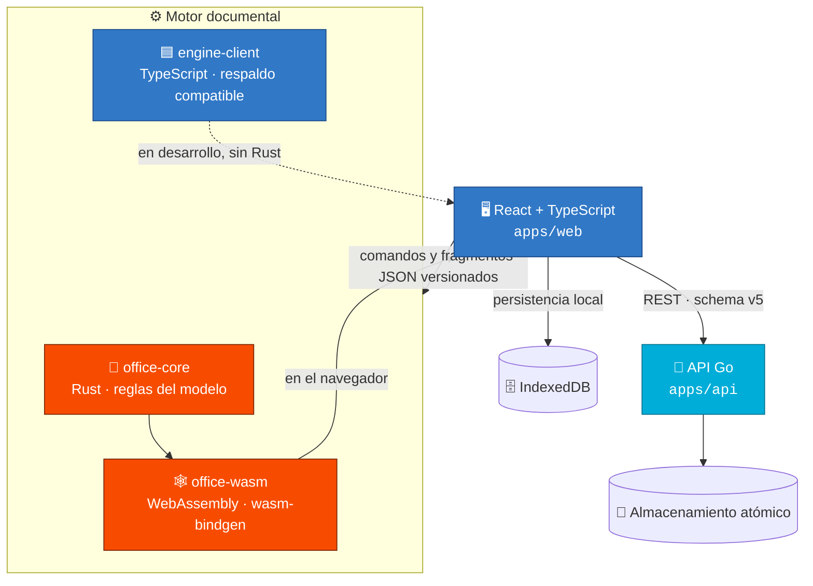
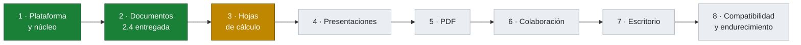

# 🦏 Rhino Suite

> **Suite ofimática web y de escritorio construida desde cero con React/TypeScript, motores Rust/WebAssembly y servicios Go — un monorepo evolutivo donde cada fase conserva las anteriores y migra sus formatos automáticamente.**

[](https://github.com/vladimiracunadev-create/rhino-suite/actions/workflows/ci.yml)
[](https://github.com/vladimiracunadev-create/rhino-suite/actions/workflows/security.yml)
[](https://github.com/vladimiracunadev-create/rhino-suite/actions/workflows/workflow-security.yml)
[](LICENSE)


> **Estado actual: Fase 2.4 — revisión, impresión e intercambio DOCX/ODT.** El formato vivo es un JSON propio versionado (schema v5). Ver el [roadmap completo](docs/ROADMAP.md).

📖 **¿Por dónde empiezo?** → [Índice de documentación](docs/INDEX.md) · [Guía de arranque](docs/GETTING_STARTED.md) · [Arquitectura](docs/ARCHITECTURE.md)

---

## ✨ Qué es

Rhino Suite es una suite ofimática que se construye **desde el modelo hacia afuera**: primero un modelo documental estructurado e independiente de la plataforma, y sobre él la interfaz, la persistencia y el intercambio de formatos. La regla central atraviesa todo el proyecto:

> Las reglas del documento **no dependen** del DOM, de React ni del sistema operativo. El HTML nunca es el estado vivo — solo una proyección.

El editor de documentos (Fase 2) ya es funcional; hoja de cálculo, presentaciones, PDF, colaboración y escritorio llegan en fases posteriores sin romper lo anterior.



> **Regla central:** el DOM y React son una *proyección* del modelo; el estado vivo es el JSON (schema v5), no el HTML. Detalle en [Arquitectura](docs/ARCHITECTURE.md).

## 🧩 Funcionalidad vigente (Fase 2.4)

- **Modelo documental estructurado** con Unicode, bus de comandos y undo/redo.
- **Edición rica**: selección multipárrafo, estilos, listas, tablas, imágenes y portapapeles propio con MIME semántico.
- **Composición avanzada**: secciones, columnas, encabezados, pies, campos dinámicos y numeración independiente por sección.
- **Revisión**: comentarios con respuestas y resolución, marcadores e hipervínculos anclados al modelo, y control de cambios con autor, estado e instantáneas reversibles.
- **Búsqueda estructurada** en cuerpo, tablas, encabezados, pies y comentarios.
- **Impresión** paginada con hoja de estilos dedicada.
- **Intercambio inicial DOCX/ODT** mediante un lector/escritor ZIP y XML OOXML/ODF propios, sin dependencias externas.
- **Persistencia**: IndexedDB en el navegador y una API Go con almacenamiento atómico en disco.

## 🏗️ Tecnologías

| Capa | Tecnología |
|---|---|
| Interfaz | React 19 · TypeScript · Vite |
| Motor principal | Rust (`crates/office-core`) |
| Puente navegador | WebAssembly · `wasm-bindgen` (`crates/office-wasm`) |
| Motor compatible | TypeScript (`packages/engine-client`, respaldo de desarrollo) |
| Servicios | Go `net/http`, sin dependencias externas |
| Persistencia local | IndexedDB |
| Intercambio | OOXML/ODF + ZIP implementados en el propio repositorio |
| Monorepo | pnpm · Cargo · Go workspace |

## ⚡ Quickstart

Requisitos mínimos: **Node ≥ 22** y **pnpm 11**. Para compilar el motor Rust/WASM y la API Go necesitas además **Rust stable + target `wasm32-unknown-unknown` + wasm-pack** y **Go 1.23**. Detalle completo en la [Guía de arranque](docs/GETTING_STARTED.md).

```bash
# 1) Interfaz web (usa el motor TypeScript de respaldo, no requiere Rust)
pnpm install
pnpm dev

# 2) API Go opcional (persistencia de documentos)
pnpm dev:api

# 3) Smoke test de la Fase 2.4 (20 aserciones, sin dependencias externas)
npx tsx scripts/validate-phase24.ts
```

Validación completa (incluye Rust/WASM y Go):

```bash
pnpm check:full
```

## 🗂️ Estructura del monorepo

```text
rhino-suite/
├── apps/
│   ├── web/            # Interfaz React/Vite (@web-office/web)
│   ├── api/            # Servicio Go: REST + almacenamiento atómico
│   └── desktop/        # Contenedor de escritorio (Fase 7, Tauri)
├── packages/
│   └── engine-client/  # Motor TypeScript compatible + adaptador de navegador
├── crates/
│   ├── office-core/    # Modelo documental Rust, independiente de plataforma
│   └── office-wasm/    # Bindings WebAssembly (JSON como contrato estable)
├── formats/            # Notas de formatos de intercambio
├── docs/               # Documentación (empieza por docs/INDEX.md)
└── deploy/             # Artefactos de despliegue
```

## 🗺️ Roadmap

Ocho fases; cada una conserva las anteriores y tiene una puerta de salida verificable. Estás aquí → **Fase 2.4**.



| Fase | Producto | Estado |
|---|---|---|
| 1 | Plataforma y núcleo común | ✅ Completada |
| 2 | Editor de documentos | ✅ Completada — 2.4 entregada |
| 3 | Hojas de cálculo | 🔜 Siguiente (3.1) |
| 4–8 | Presentaciones · PDF · Colaboración · Escritorio · Compatibilidad | 🗓️ Planificadas |

Detalle, objetivos y puertas de salida en [ROADMAP.md](docs/ROADMAP.md).

## 📚 Documentación

Toda la documentación vive en [`docs/`](docs/) y tiene su mapa de navegación en **[docs/INDEX.md](docs/INDEX.md)**. Puntos de entrada frecuentes:

- [Guía de arranque](docs/GETTING_STARTED.md) — de cero a la app corriendo.
- [Arquitectura](docs/ARCHITECTURE.md) — capas, límites y decisiones.
- [Formato interno (schema v5)](docs/INTERNAL_FORMAT.md) · [Modelo de revisión](docs/REVIEW_MODEL.md)
- [API Go](docs/API.md) · [Compatibilidad DOCX/ODT](docs/FORMAT_COMPATIBILITY.md)
- [Roadmap](docs/ROADMAP.md) · [Glosario](docs/GLOSSARY.md) · [FAQ](docs/FAQ.md)
- [Decisiones de arquitectura (ADR)](docs/adr/)

## 🧪 Calidad y CI

Cada push y PR ejecuta en GitHub Actions:

- **CI** — typecheck + tests TypeScript + build web · `cargo fmt`/`clippy`/`test` + build WASM · `go vet`/`test -race`/`build`.
- **Security Scan** — CodeQL (JS/TS), Trojan Source y escaneo *advisory* de dependencias (govulncheck, cargo-audit).
- **Workflow security** — actionlint + zizmor + verificación de pin a SHA de todas las acciones.

Detalle en [VALIDATION.md](docs/VALIDATION.md) y [SECURITY.md](SECURITY.md).

## 🤝 Contribuir

Lee [CONTRIBUTING.md](CONTRIBUTING.md). En resumen: rama corta por cambio, Conventional Commits, y toda mutación del modelo interno incluye migración, prueba y contrato equivalente Rust/TypeScript.

## 🔒 Seguridad

Rhino Suite es un entorno de desarrollo por fases y no debe exponerse a Internet tal cual. Política y modelo de amenaza en [SECURITY.md](SECURITY.md).

## 📄 Licencia

[MIT](LICENSE) © Vladimir Acuña.
