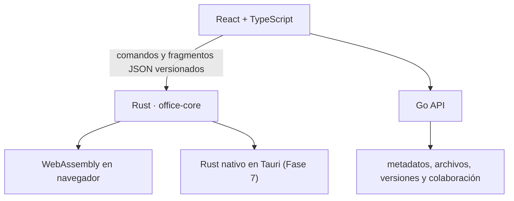
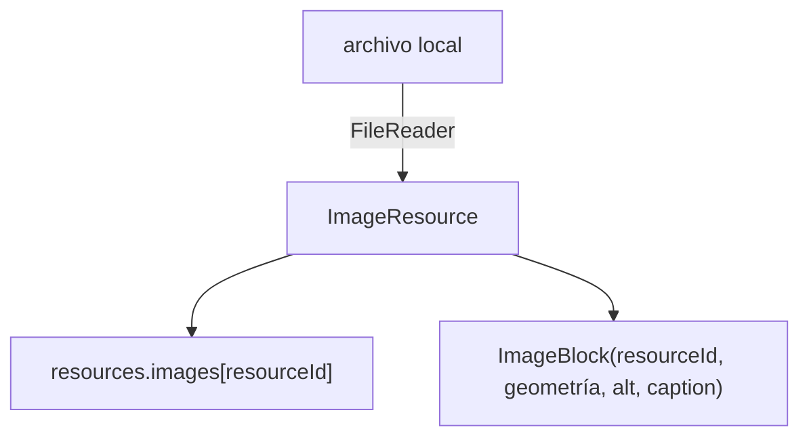

# Arquitectura

## Principio central

La interfaz, los motores y los servicios de red son componentes distintos. Las reglas importantes no pueden depender del DOM, de React ni de Windows.

## Capas vigentes en la Fase 2.5

### `crates/office-core`

Modelo documental independiente de plataforma. Incluye bloques de texto, tablas, imágenes y saltos; recursos; secciones; encabezados/pies; campos; revisión; comentarios; marcadores; hipervínculos; control de cambios; estilos; comandos; migración; normalización y undo/redo.

### `crates/office-wasm`

Capa pequeña de interoperabilidad. Acepta y devuelve JSON para mantener un contrato estable entre Rust y TypeScript.

### `packages/engine-client`

Adaptador del navegador. Carga WASM cuando existe y utiliza un motor TypeScript compatible durante el desarrollo. Contiene selección documental, fragmentos de portapapeles, layout consciente de secciones, columnas, texto, tablas, imágenes y saltos; búsqueda estructurada; intercambio DOCX/ODT; ZIP propio y persistencia IndexedDB.

### `apps/web`

Interfaz React/Vite. Captura entrada, selección, portapapeles y manipulación de objetos, pero no persiste HTML ni aplica por sí misma las reglas del modelo.

### `apps/api`

Servicio Go con una única dependencia externa: `golang.org/x/crypto`, para derivar contraseñas con Argon2id (ver [ADR 0009](adr/0009-accounts-and-sharing.md)). Expone API REST, autentica y autoriza cada petición, y persiste documentos, versiones, carpetas y cuentas de forma atómica. El contrato `Store` permitirá reemplazar disco local por PostgreSQL y almacenamiento de objetos.

## Flujo de recursos de imagen

Separar contenido binario y bloque prepara carga diferida, deduplicación y almacenamiento S3 sin alterar el modelo de layout.

## Decisiones deliberadas

- El formato interno es propio y versionado.
- DOCX, XLSX, PPTX y PDF serán entrada/salida, no estado vivo.
- El portapapeles propio transporta semántica, no HTML arbitrario.
- El historial todavía usa snapshots; después migrará a operaciones compactas y CRDT.
- El almacenamiento Go actual es local para facilitar pruebas, no la arquitectura final de nube.
- El motor TypeScript de respaldo debe conservar compatibilidad semántica con Rust.
