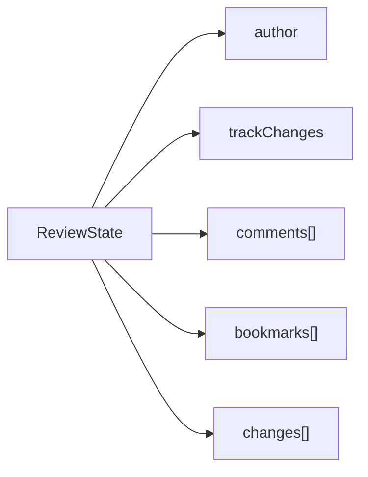

# Modelo de revisión — schema v5

La revisión se almacena en `TextDocument.review` y no depende de elementos DOM.

## Estructura

### Comentarios

Cada hilo posee un `DocumentRange`, una cita y mensajes independientes. Resolver un hilo no lo elimina, permitiendo reabrirlo y mantener auditoría.

### Marcadores

Los marcadores usan nombres únicos sin distinguir mayúsculas y minúsculas. Apuntan a un rango, que puede ser un cursor colapsado o una selección.

### Hipervínculos

Los vínculos pertenecen a `TextRun.hyperlink`. Esto evita mezclar semántica con `TextStyle` y permite conservar diferentes enlaces aunque compartan fuente, tamaño y color.

### Control de cambios

Al activarse, cada comando documental rastreable registra:

- Autor.
- Tipo de comando.
- Clase de cambio.
- Resumen.
- Revisión posterior.
- Estado.
- Instantánea anterior sanitizada.

Las instantáneas eliminan instantáneas anidadas para impedir crecimiento recursivo. El rechazo individual es seguro para el último cambio pendiente. Un cambio anterior se marca como conflicto si existen cambios pendientes posteriores. `rejectAllChanges` restaura la primera instantánea pendiente.

Este mecanismo es deliberadamente conservador. Una representación operacional granular y colaborativa llegará con CRDT en la Fase 6.
